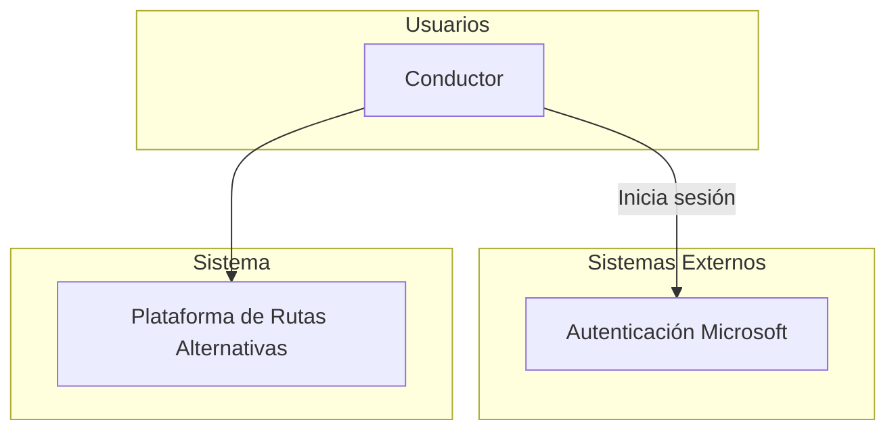
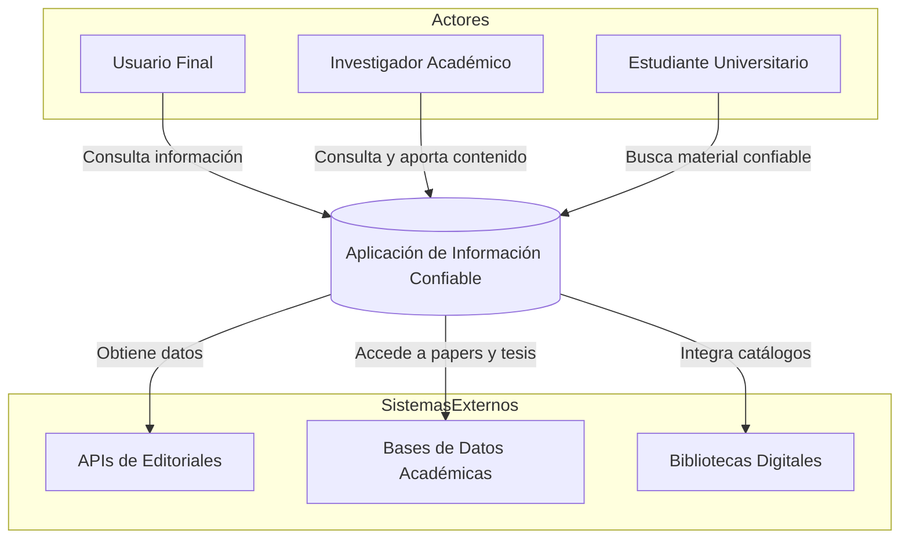

## Contenido
 
## 1. Introducción
 
TODO: Redactar un parrafo donde se de una situación al contenido de este documento
 
### 1.1 Proposito
 
En este documento se define las especificaciones funcionales y no funcionales de gamificación sobre el uso de rutas alternativas para la ciudad de Bogotá. Este sera utilizado como guia para clientes y desarrolladores.
 
### 1.2 Alcance
 
### 1.3 Personal involucrado
 
### 1.4 definicones, acronimos, abre

### 1.5 Referencias
 
### 1.6 Resumen
 
## 2. Descripción
 
### 2.1 Perspectiva del producto
 
#### Diagrama de contexto 

 

 
